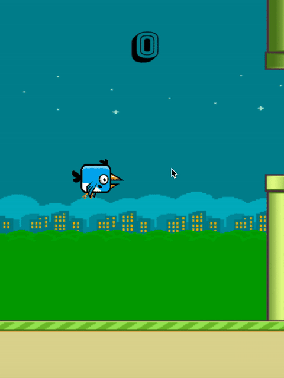

# tweetybird
A Flappy Bird inspired clone using Javascript, Canvas, and HTML5. 

[View Live Site Here](https://ebaek.github.io/tweetybird/)
---

## Background and Overview
  ### Motivation: 
  * Flappy Bird will always stand out to me as a childhood favorite. I decided to clone the game because I wanted to learn 
  more about sprites and how to account for collisions. This was a super fun project and I hope to write more games in the 
  future! 
  
  ### Goals 
  * Animate tweetybird and background by utilizing sprite sheet on HTML5 canvas for dynamic and smooth rendering
  * Simulate flying physics and collision detection with platform rendering that efficiently updates game state

## Architecture and Technologies
  * Vanilla Javascript for overall structure and create an interactive game 
  * HTML5 Canvas to render game components (bird, background, pipes)
  * Webpack to bundle scripts into a single source

## Future Features
* Rankings: store scores in AWS or Google Firebase 
* Sound effects: mimic bird movements and collisions 
